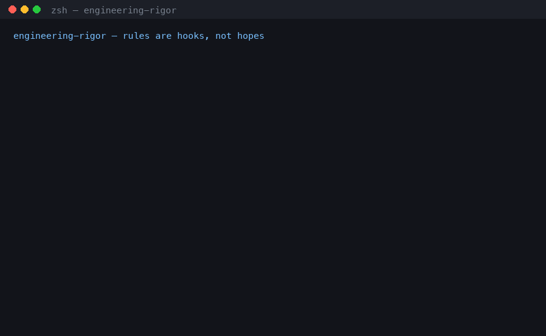

<div align="center">
  
</div>

# engineering-rigor

> *A Python template where the engineering rules are hooks, not hopes.*

<p align="center">
  <a href="https://github.com/ujjaval-verma/engineering-rigor/actions/workflows/ci.yml"></a>
  
  
  
</p>

<div align="center">
  
  <br><sub>Reconstruction — the guard-gate messages and the pytest line are verbatim.</sub>
</div>

**Guidelines drift. Hooks don't.**

## Quickstart

Click **Use this template** at the top of this page (or fork it), then:

> **TL;DR — have `uv`? then:** `uv tool install rust-just && just sync && just check`
> (`just sync` is also what wires `core.hooksPath` to `.githooks/`.)

```sh
git clone https://github.com/YOU/YOUR_REPO && cd YOUR_REPO
curl -LsSf https://astral.sh/uv/install.sh | sh  # skip if you already have uv
uv tool install rust-just
just sync && just check                          # clone → green, ~15 s per CI's `time` lines
just init my_project                             # rename the placeholder package
```

<details>
<summary>Two footnotes on that block</summary>

Four commands after the clone, not three: a cold reader has no `uv`, and `uv tool install` needs it.
The ~15 s is CI's own `time just sync` + `time just check` — that log, not this README, is the authority.
</details>

## What this enforces

Three properties, each one a check that exits non-zero:

1. **Done means green.** `just check` — lint, types, 164 of the suite's 169 tests — runs as a
   *blocking* Claude `Stop`/`SubagentStop` hook and on `.githooks/pre-commit`. An agent that says
   "done" while red gets exit 2 and its own failure output back.
2. **The gate can't be talked around.** `harness/guard-gate.sh` (PreToolUse) refuses
   `--no-verify`, `hooksPath` tricks, force-push, `pip`, and shell edits to `justfile`,
   `harness/`, `.githooks/`, `.claude/`, `.env` — before the command runs. It is a speed bump,
   not a sandbox: it matches the verbs it names, and its header lists what it still cannot see.
3. **Nothing leaves the machine unverified.** `.githooks/pre-push` first checks the working tree
   for uncommitted gate edits, then runs `just verify` on *each pushed sha* in a temp worktree.

`just` with no args is the menu. `check` is the fast tier (< 30 s warm); `verify` is everything.

<details>
<summary>Every rule and its exit code</summary>

| rule | mechanism | when bypassed |
|---|---|---|
| work isn't done until `just check` is green | Claude `Stop`/`SubagentStop` hook (`harness/gate.sh`), `.githooks/pre-commit` | hook exits 2; agent must fix |
| no `--no-verify`, `hooksPath`, force-push (`-f`, `--force`, `+refspec`), `pip`, or shell edits to the gate itself (`sed -i`/`--in-place`, `perl -i`, `rm`/`mv`/`cp`/`ln`/`tee`, `chmod`/`chown`/`truncate`/`touch`, `dd of=`, `git restore`/`checkout --`, redirects, `python -c`/stdin scripts, `eval`) | `harness/guard-gate.sh` (PreToolUse) + `.claude/settings.json` deny list | command refused before it runs |
| a push carries no uncommitted gate edits, and every pushed commit verifies | `.githooks/pre-push`: working tree vs local HEAD, then `just verify` per pushed sha in a temp worktree | push refused |
| commits are `type(scope): subject` | `harness/check-commit-msg.py` via `.githooks/commit-msg` | commit refused |
| no deferred-work markers in code | `harness/check-no-todo.sh` (`just markers`) → `docs/FOLLOWUPS.md` | `verify` fails |
| no stray root markdown, no broken doc links | `check-stray-md.sh`, `check-links.py` | `verify` fails |
| no credentials in tracked files | `harness/check-secrets.py`: vendor prefixes, then credential-shaped values (mixed character classes), with placeholder wording filtered out | `verify` fails |
| model ids match the dated allow-list in `AGENTS.md` | `harness/check-models.py` | `verify` fails |
| every invariant in `CLAUDE.md` names its enforcement site — a file that exists, or `prose` | `harness/check-invariants.py` | `verify` fails |
| generated artifacts and `uv.lock` never drift | `harness/check-drift.sh` | `verify` fails |

</details>

The pre-push tamper check is deliberately narrow: it compares your **working tree's** gate files
against your local HEAD, so it refuses a push made around an uncommitted edit. A gate gutted *in a
commit* passes it — that commit's own `justfile` is what `verify` runs; CI and review catch that.

## Try to cheat it

`--no-verify` is not a flag here; it is a bug report. Ask an agent to ship past a red gate and watch
it try every door: guard-gate refuses the flag and refuses rewriting the `justfile` from a shell, the
deny list refuses editing it with the file tools, and a commit still meets pre-commit. Fix the code.

<details>
<summary>How the pieces fit</summary>

```
  trigger                   entry point                   recipe
  ────────────────────────────────────────────────────────────────────────────
  agent runs a command  ──▶  harness/guard-gate.sh     ──▶  (refused, or runs)
  agent says "done"     ──▶  harness/gate.sh           ──▶  just check
  git commit            ──▶  .githooks/pre-commit      ──▶  just check
  git push              ──▶  .githooks/pre-push        ──▶  just verify
  GitHub Actions        ──▶  .github/workflows/ci.yml  ──▶  just verify
```

Four of the five end at the same recipe — `verify` is `check` plus the file checks and the full
suite. guard-gate is the one that ends *before* anything runs.
</details>

## Why `just`, not `make`

One discovery surface: `just` with no args lists every recipe, and the git hooks, CI and you all
invoke that same recipe rather than three drifting copies of it. Every other pick, with its why and
the trigger that would change it, is in [`docs/tooling.md`](docs/tooling.md).

## What this is *not*

- Not security. A speed bump for agents, not a sandbox; `guard-gate.sh`'s header says what it misses.
- Not a framework. `harness/` is stdlib sh/python — every script ≤80 lines (≤100 for the secret
  and link scanners), with `--help`. Swap the `lint`/`types`/`test` recipes to port it.
- Not opinionated about your app. `src/example_app` is one strict-typed contract and a settings file.

## Where things live

[`CLAUDE.md`](CLAUDE.md) gate rules + invariants · [`AGENTS.md`](AGENTS.md) model policy + slice
delivery · [`docs/tooling.md`](docs/tooling.md) every pick with its why ·
[`docs/FOLLOWUPS.md`](docs/FOLLOWUPS.md) the only legal home for deferred work.

MIT — see [`LICENSE`](LICENSE).
